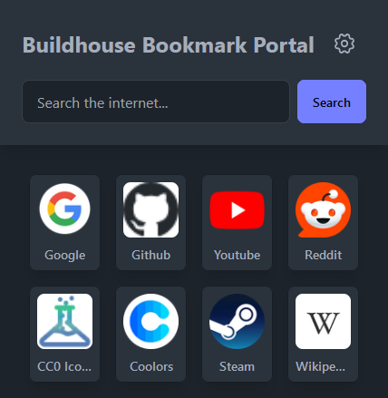
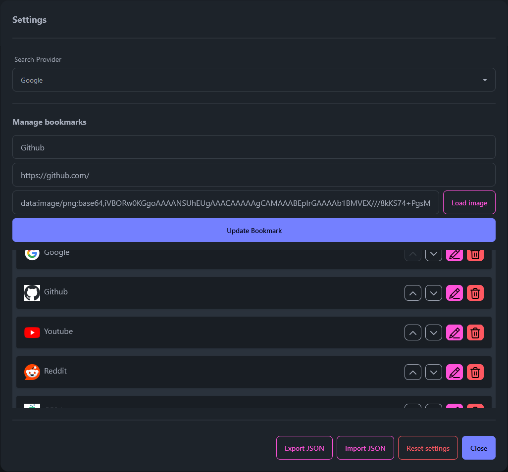

# Buildhouse Bookmark Portal
A PWA app to manage bookmarks and open the web pages "in-app".
Bookmarks are locally stored in the browser.
The app is freely hosted on [bbp.pascalbouwhuis.nl](https://bbp.pascalbouwhuis.nl)

## Backstory
A few years ago, my dad grew frustrated with existing bookmark managers he found, and requested me that I create a custom one. That resulted in [buildhouse-bookmarkmanager-client](https://github.com/Gabbersaurus/buildhouse-bookmarkmanager-client) and [buildhouse-bookmarkmanager-server](https://github.com/Gabbersaurus/buildhouse-bookmarkmanager-server). Over time, the original codebase became outdated due to a lack of active maintenance, resulting in several deprecated dependencies. Updating these dependencies would have required rewrites, but given the likelihood of it all happening again, I decided that a full reimagining was the better option. In this new version, bookmarks are stored locally, which means they are no longer automatically synced between clients. While this might be slightly less convenient, the stored bookmarks can still be easily exported and imported to sync between devices. The key benefit is that there is no longer a need to host and maintain a back-end server.

I chose Svelte simply because I wanted to try something other than React and Vue, and I heard positive things about it.

## Overview
The app opens on the overview. On the top of the overview, you see the search bar and the settings button.
Under the top bar, you see the grid of all stored bookmarks.

### Settings
By pressing the settings button, you open the settings modal. In this modal, you can choose the search provider for the search bar.  The following search providers are currently available:
-   DuckDuckGo
-   Google
-   Ecosia
-   Bing

In the settings, you manage the bookmarks. Here, you can add, edit, sort and delete them.
Every bookmark has three properties:
- Title
The title shown under the favicon on the overview.
- Url
The URL will be be opened when the bookmark is pressed. It should include the protocol.
- Favicon
A Base64 image data URI for the favicon. These can be imported by selecting an image file in the browser. The image will be converted to a Base64 data URI.

Every change in the settings is pushed to the browser's LocalStorage, so it remembers your settings when you reload the page.
The settings can be exported to JSON and imported again in the settings modal. This way, you can easily share the bookmarks between devices.

#### Limitations
Everything, including the favicons, is stored in LocalStorage. LocalStorage does have a limit, which is not the same for every browser. However, realistically, this limit will likely not be reached. Just keep in mind to keep the resolutions of the favicons in check. I recommend sticking to something like 128x128px.

## Scripts
In the scripts folder, there is a simple javascript/node script that loads the `bbp_settings.json` file and attempts to automatically fetch favicon images for the bookmarks. I added this since in this version of the app, favicons cannot be automatically fetched due to CORS.
This uses a public favicon API by Google to get and resize favicons, so locally hosted sites will not be reached with this script. For those, you can still import your own favicons in the app.

## TODO
At the moment, there is no validation for the settings. Validation should be implemented when loading settings from LocalStorage, within the settings modal's form, and during the JSON import process. However, given the current user base of the app, this is not a high priority.

## Special thanks
Thanks to [cc0-icons.jonh.eu](https://cc0-icons.jonh.eu/) for providing a good-looking icon set under the CC0 license.
